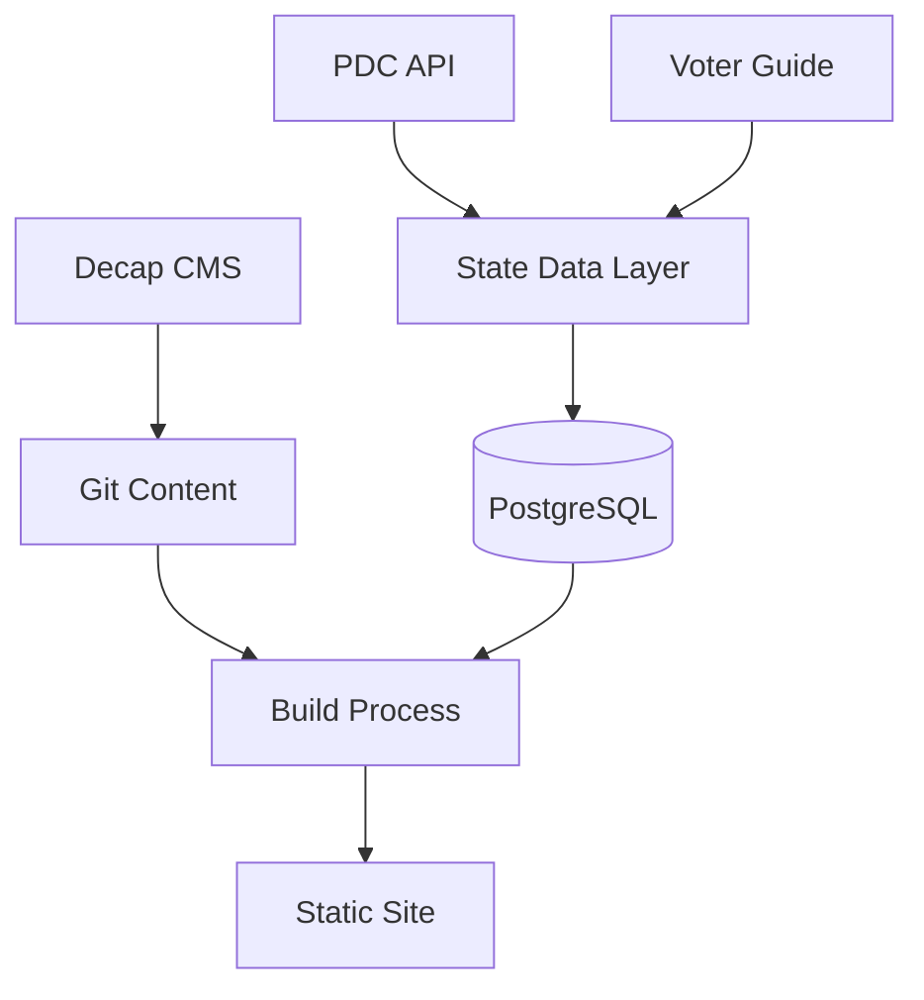

# Tri-Cities Vote Refactor

## Current Status
We're modernizing the Tri-Cities Vote site's data layer while preserving its editorial workflow and React frontend. The main goals are:
- More efficient data management
- Better handling of state data integration
- Smoother year-to-year transitions
- Proper tracking of term lengths and election results
- Keep the original React frontend and css roughly intact (in legacy/gatsby/src)

### What We've Done

1. Created New Database Schema
- Moved from flat JSON files to PostgreSQL
- Preserved the core data model (candidates, races, offices, regions)
- Added proper relationships and constraints
- Matches existing content structure for smooth transition
- Set up enum types that match current Decap CMS configuration

2. Added Election Results Support
- Created models for tracking vote counts and percentages
- Special handling for Richland's unique term length rules
- Infrastructure for importing results from WA state
- Foundation for automating incumbent detection

3. State Data Integration
- Set up API client for PDC data
- Added proper type definitions for all data sources
- Built rate-limiting and pagination support
- Created name normalization system for matching candidates

4. Codebase Organization
- Moved all Gatsby-related code to `legacy/` directory for reference
- Cleaned up root directory to contain only modern stack components
- Preserved old data structures and scripts for migration reference
- Simplified project structure for better maintainability

### Next Steps

1. Data Migration
```typescript
// Create script to import existing data:
async function migrateExistingData() {
  // 1. Import regions and offices (permanent structure)
  // 2. Import 2023 candidates and races
  // 3. Import endorsements
  // 4. Validate relationships
}

// Import election results:
async function importResults() {
  // 1. Fetch results from WA state site
  // 2. Match candidates
  // 3. Record vote counts
  // 4. Determine term lengths for Richland
}
```

2. PDC Integration
- Write scripts to pull contribution data
- Set up regular updates during election season
- Create visualizations of financial data
- Add donor name normalization

3. Editorial Workflow
- Keep Decap CMS for content management
- Update config to work with new data structure
- Add validation rules
- Preserve PR-based review process

4. Development Setup
```bash
# Local development setup:
npm install
npx prisma generate
npm run db:seed  # Add base data

# Import existing content:
npm run migrate-data
npm run import-pdc

# Start developing:
npm run dev
```

5. Testing and Validation
- Add schema validation
- Create data integrity checks
- Test term length calculation
- Verify state data integration

## Architecture Details

### Database Structure
- Core structural data in PostgreSQL
- Editorial content managed through git/Decap
- Photos and static assets in filesystem
- State data pulled from APIs

### Data Flow


### State Integration
- PDC data pulled via Socrata API
- Election results scraped from state site
- Name matching system for reconciliation
- Term length determination automation

## Migration Plan

1. Phase 1: Core Data (Current)
- [x] Set up database schema
- [x] Create migration tools
- [x] Configure state data client
- [ ] Import basic office/region data

2. Phase 2: Content Migration
- [ ] Migrate 2023 candidate data
- [ ] Import race configurations
- [ ] Transfer endorsements
- [ ] Update CMS configuration

3. Phase 3: Election Results
- [ ] Import 2023 results
- [ ] Calculate term lengths
- [ ] Mark incumbents
- [ ] Set up results automation

4. Phase 4: PDC Integration
- [ ] Import historical contribution data
- [ ] Set up regular PDC updates
- [ ] Add contribution visualizations
- [ ] Implement donor matching

5. Phase 5: Testing & Launch
- [ ] Validate all data relationships
- [ ] Test editorial workflows
- [ ] Run parallel with old system
- [ ] Switch to new system

## Development Notes

### Local Setup
1. Clone repo
2. Copy .env.example to .env
3. Add Railway PostgreSQL URL
4. Run migrations
5. Import seed data

### API Keys Needed
- Socrata API credentials for PDC
- Railway database credentials
- GitHub tokens for CMS

### Common Tasks
```bash
# Update schema:
npx prisma migrate dev

# Reset development data:
npx prisma migrate reset
npm run db:seed

# Import new PDC data:
npm run import-pdc

# Test data integrity:
npm run validate-data
```

## Future Considerations

1. Performance Optimizations
- Caching for PDC data
- Incremental static regeneration
- Efficient contribution queries

2. Enhanced Features
- Better contribution visualizations
- Automated incumbent detection
- Historical election data analysis

3. Editorial Improvements
- Enhanced validation rules
- Better preview capabilities
- Automated fact checking

4. Technical Debt
- Type safety improvements
- Test coverage
- Documentation updates