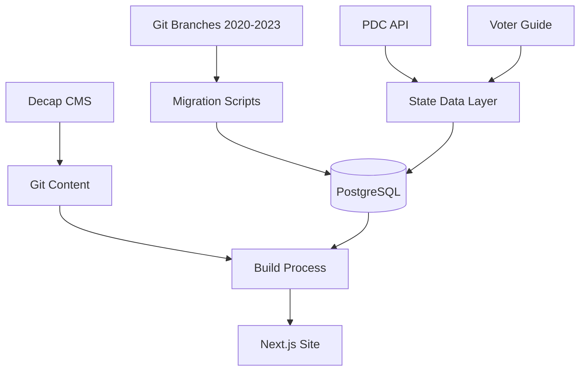

# Tri-Cities Vote Refactor

## Current Status
We're modernizing the Tri-Cities Vote site's data layer while preserving its editorial workflow and React frontend. The main goals are:
- More efficient data management
- Better handling of state data integration
- Smoother year-to-year transitions
- Proper tracking of term lengths and election results
- Keep the original React frontend and css roughly intact (in legacy/gatsby/src)

### What We've Done

1. Created New Database Schema
- Moved from flat JSON files to PostgreSQL
- Preserved the core data model (candidates, races, offices, regions)
- Added proper relationships and constraints
- Matches existing content structure for smooth transition
- Set up enum types that match current Decap CMS configuration

2. Added Election Results Support
- Created models for tracking vote counts and percentages
- Special handling for Richland's unique term length rules
- Infrastructure for importing results from WA state
- Foundation for automating incumbent detection

3. State Data Integration
- Set up API client for PDC data
- Added proper type definitions for all data sources
- Built rate-limiting and pagination support
- Created name normalization system for matching candidates

4. Codebase Organization
- Moved all Gatsby-related code to `legacy/` directory for reference
- Cleaned up root directory to contain only modern stack components
- Preserved old data structures and scripts for migration reference
- Simplified project structure for better maintainability

5. Historical Data Migration (COMPLETED)
- Successfully migrated all election data from Git branches to PostgreSQL
- Imported 145 candidates across 4 years (2020-2023)
- Created 54 offices across 7 regions
- Implemented geographic guide groupings with 8 guides
- Preserved all race relationships and UUIDs
- Dynamic office creation based on actual candidate data
- Support for all election types: municipal, county, state, federal

### Next Steps

1. Frontend Integration
- Build Next.js frontend to query PostgreSQL data
- Create voter guide views using geographic groupings
- Implement candidate profile pages
- Add search and filtering capabilities

2. Election Results Integration
```typescript
// Import election results:
async function importResults() {
  // 1. Fetch results from WA state site
  // 2. Match candidates to existing database records
  // 3. Record vote counts and percentages
  // 4. Determine term lengths for Richland
  // 5. Mark winners and update incumbent status
}
```

3. PDC Integration
- Write scripts to pull contribution data
- Set up regular updates during election season
- Create visualizations of financial data
- Add donor name normalization

4. Editorial Workflow
- Keep Decap CMS for content management
- Update config to work with new data structure
- Add validation rules
- Preserve PR-based review process

5. Development Setup
```bash
# Local development setup:
npm install
npx prisma generate
npm run db:seed  # Add base data

# Import historical election data:
npm run migrate:all-years

# Import PDC financial data:
npm run import-pdc

# Start developing:
npm run dev
```

6. Testing and Validation
- Add schema validation
- Create data integrity checks
- Test term length calculation
- Verify state data integration

## Architecture Details

### Database Structure
- Core structural data in PostgreSQL (regions, offices, races, candidates)
- Geographic guide groupings for location-based voter guides
- Editorial content managed through git/Decap
- Photos and static assets in filesystem
- State data pulled from APIs

### Data Organization
The database is organized around geographic regions and office types:

**Regions (7 total)**:
- Kennewick
- Pasco
- Richland
- West Richland
- Benton County
- Franklin County
- Walla Walla County

**Offices (54 total)** dynamically created based on candidate data:
- Municipal: City Council, Mayor, School Board, Port Commissioner
- County: County Commissioner, Sheriff, Prosecutor, Superior Court Judge
- State: State Representative, State Senator
- Federal: US House, US Senate

**Guides (8 total)** provide geographic groupings:
- County guides for 2020/2022 elections
- City guides for 2021/2023 elections
- Each guide contains relevant races for that location

### Data Flow


### State Integration
- PDC data pulled via Socrata API
- Election results scraped from state site
- Name matching system for reconciliation
- Term length determination automation

## Migration Plan

1. Phase 1: Historical Data Migration (COMPLETED ✅)
- [x] Set up database schema
- [x] Create migration tools
- [x] Configure state data client
- [x] Import all historical election data (2020-2023)
- [x] Create geographic guide groupings
- [x] Migrate 145 candidates across 54 offices and 7 regions
- [x] Preserve race relationships and UUIDs

2. Phase 2: Frontend Development (NEXT)
- [ ] Build Next.js application structure
- [ ] Create guide-based voter guide views
- [ ] Implement candidate profile pages
- [ ] Add search and filtering by region/office
- [ ] Test with existing data

3. Phase 3: Election Results Integration
- [ ] Import historical election results
- [ ] Calculate term lengths (especially Richland rules)
- [ ] Mark incumbents and winners
- [ ] Set up results automation for future elections

4. Phase 4: PDC Integration
- [ ] Import historical contribution data
- [ ] Set up regular PDC updates
- [ ] Add contribution visualizations
- [ ] Implement donor matching

5. Phase 5: CMS & Editorial Workflow
- [ ] Update Decap CMS configuration
- [ ] Validate editorial workflows
- [ ] Add validation rules
- [ ] Test content management

6. Phase 6: Testing & Launch
- [ ] Validate all data relationships
- [ ] Performance testing
- [ ] Run parallel with old system
- [ ] Switch to new system

## Development Notes

### Local Setup
1. Clone repo
2. Copy .env.example to .env
3. Add Railway PostgreSQL URL
4. Run migrations
5. Import seed data

### API Keys Needed
- Socrata API credentials for PDC
- Railway database credentials
- GitHub tokens for CMS

### Common Tasks
```bash
# Update schema:
npx prisma migrate dev

# Reset development data:
npx prisma migrate reset
npm run db:seed

# Import historical election data:
npm run migrate:all-years

# Import specific year:
npm run migrate:2023

# Import new PDC data:
npm run import-pdc

# Test data integrity:
npm run validate:2023
```

### Migration Scripts
- `scripts/migrate/dynamic-base.ts` - Creates regions and offices dynamically
- `scripts/migrate/year.ts` - Imports candidate and guide data for a specific year
- `scripts/migrate/import-all-years.ts` - Orchestrates migration across all years
- `scripts/migrate/validate-2023.ts` - Validates data relationships

## Future Considerations

1. Performance Optimizations
- Caching for PDC data
- Incremental static regeneration
- Efficient contribution queries

2. Enhanced Features
- Better contribution visualizations
- Automated incumbent detection
- Historical election data analysis

3. Editorial Improvements
- Enhanced validation rules
- Better preview capabilities
- Automated fact checking

4. Technical Debt
- Type safety improvements
- Test coverage
- Documentation updates